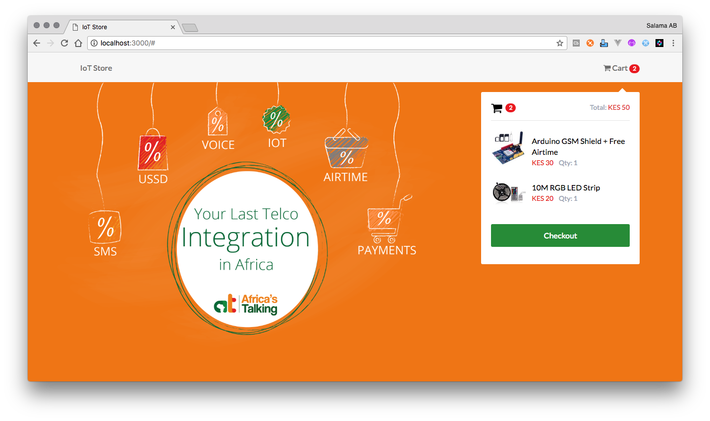

# IoT Store

`<`

> Demo a simple checkout process complete with SMS, Airtime, M-Pesa and USSD



**Get Started**

Assuming you have `node` and `git` installed, run the following:

```shell
$ git clone https://github.com/AfricasTalkingLtd/iot-store.git
$ cd iot-store
$ # vim config/default.json and add your API key, username and other configs. e.g:
$ # {
$ #    "africastalking": {
$ #       "username": "def", // your app username on Africa's Talking
$ #       "apiKey": "abc", // your app API Key
$ #       "senderId": null, // if you don't have an alphanumeric or short code
$ #       "ussd": "*384*1409#", // your USSD code
$ #       "payments": {
$ #           "product": "IoT Store" // Your Payment product
$ #       }
$ #    }
$ # }
$ npm install
$ npm start # Now open http://localhost:3000/
```

**Happy Coding!**

`/>`